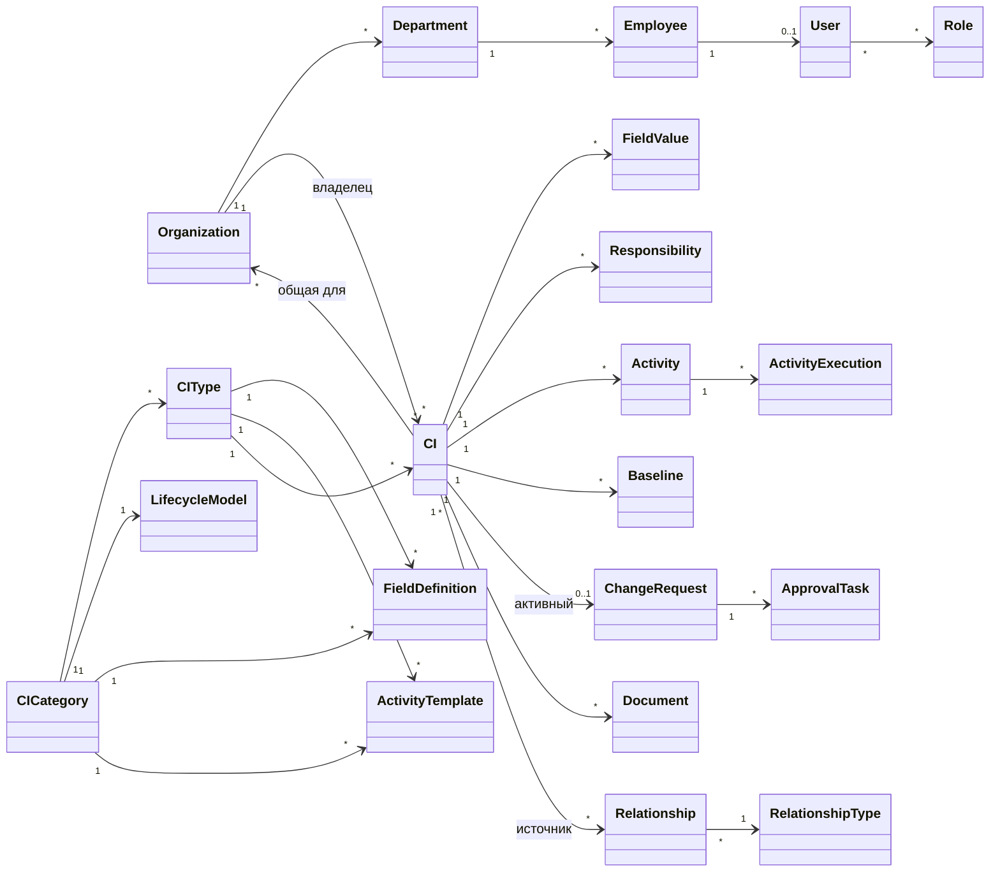
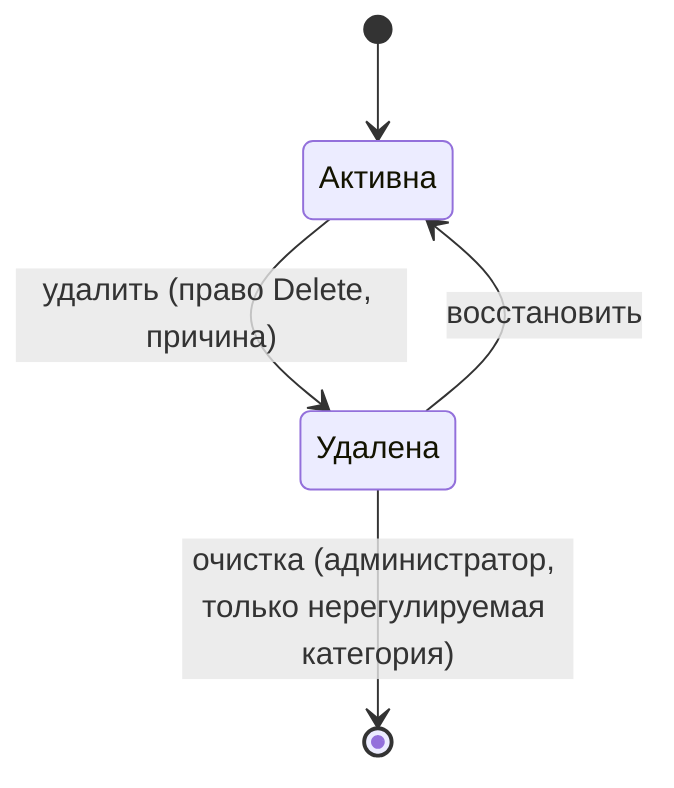
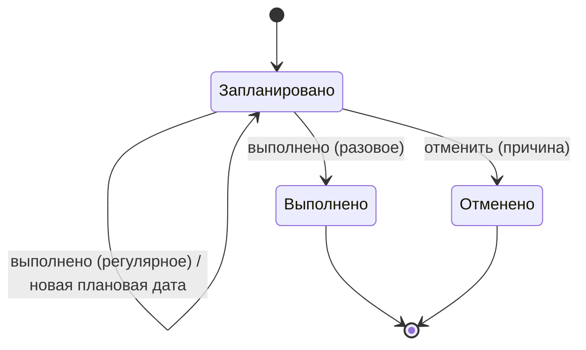
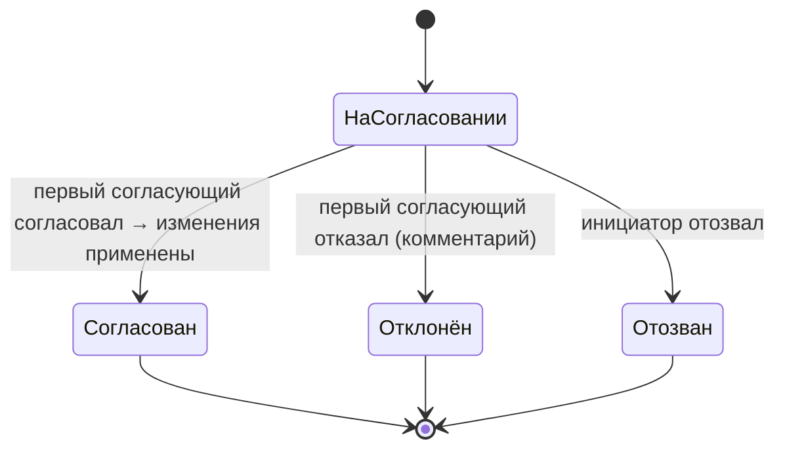

# Доменная модель KE

> Статус: **draft** · 2026-10-08 · Аналитик
> Это **логическая** модель: сущности, атрибуты, связи, жизненные циклы и инварианты. Таблицы, индексы и API проектирует Архитектор.
> Термины — по [GLOSSARY.md](GLOSSARY.md). Источники: `[S1 ¶N]` — описание ВП; `[S2]` — записка коллег; `P-n`, `Rn`, `R2-n` — предложения и решения из [discovery.md](discovery.md).
> Типы атрибутов логические: строка, текст, число, дата, дата-время, флаг, ссылка на сущность, запись справочника.

---

## 0. Общая картина

---

## 1. Справочники и перечисления

По решению ВП (комментарий к §5.5 discovery) **любой выбираемый из списка параметр — справочник**. Исключения — перечисления продукта.

**Справочник** (`Directory`):

| Атрибут | Тип | Обяз. | Правила |
|---|---|---|---|
| Код | строка | да | латиница, уникален в установке, после создания не меняется |
| Название | строка | да | — |
| Описание | текст | нет | — |
| Иерархический | флаг | да | записи образуют дерево (например, Местоположения) |
| Системный | флаг | да | справочник поставлен продуктом или пакетом. Удалить нельзя, состав записей менять можно |

**Запись справочника** (`DirectoryEntry`):

| Атрибут | Тип | Обяз. | Правила |
|---|---|---|---|
| Справочник | ссылка | да | — |
| Код | строка | да | уникален в справочнике, после создания не меняется |
| Название | строка | да | — |
| Родитель | ссылка на запись | нет | только для иерархических справочников |
| Порядок | число | да | порядок в списках выбора |
| Цвет | цвет | нет | для статусов, критичности и т.п. |
| Действует | флаг | да | недействующую запись нельзя выбрать в новых данных; уже сохранённые значения остаются |
| Системная запись | флаг | да | от записи зависит логика продукта или пакета: переименовать можно, удалить или деактивировать нельзя |

Справочники, которые поставляются с продуктом:
- Критичность;
- Роли ответственности (P-10);
- Виды документов, Статусы документов (P-11);
- Виды мероприятий;
- Значения подписи;
- Причины отмены мероприятия;
- Местоположения (иерархический);
- справочники GxP-пакета: GxP-значимость, Категория GAMP 5, Влияние, Риск, Статус валидации (discovery §5.5).

Администратор создаёт **пользовательские справочники** для своих полей (P-14).

**Перечисления продукта** — фиксированные списки, новое значение в которых требует кода:
- типы данных полей;
- виды каналов уведомлений;
- виды таск-трекеров;
- статусы мероприятия, запроса на изменение и задания на согласование;
- действия контрольного следа;
- единицы интервала (день, неделя, месяц, год).

Названия значений перечислений переводятся механизмом локализации.

Отдельные сущности с собственными атрибутами — не справочники: Организация, Подразделение, Сотрудник, Контрагент, Контактное лицо, Тип связи. Их можно расширять настраиваемыми полями — это открытый вопрос OQ-1.

---

## 2. Организации и люди

### 2.1 Организация `Organization` [R2-2a]
Код (уникальный, неизменяемый), наименование, ИНН (нет), действует (да).
- Измерение данных: у каждой КЕ есть организация-владелец.
- Конфигурация (категории, типы, справочники, роли) — общая на всю установку.

### 2.2 Подразделение `Department`
Организация (да), родитель (нет — дерево), код, наименование, руководитель (сотрудник, нет), действует.

### 2.3 Сотрудник `Employee` [R7a]
| Атрибут | Тип | Обяз. | Правила |
|---|---|---|---|
| ФИО | строка | да | — |
| Организация | ссылка | да | — |
| Подразделение | ссылка | нет | — |
| Должность | строка | нет | — |
| E-mail | строка | нет | формат e-mail; нужен для уведомлений по e-mail |
| Телефон | строка | нет | — |
| Внешние идентификаторы | список (источник, ID) | нет | AD objectGUID, табельный номер 1С:ЗУП; ключ синхронизации |
| Состояние | перечисление | да | Работает / Уволен. Уволенного нельзя назначить новым ответственным |

### 2.4 Пользователь `User`
| Атрибут | Тип | Обяз. | Правила |
|---|---|---|---|
| Сотрудник | ссылка | да | один сотрудник — не более одной учётной записи |
| Логин | строка | да | уникален в установке |
| Источник аутентификации | перечисление | да | локальная / LDAP-AD / SSO |
| Роли | ссылки | нет | одному пользователю можно назначить несколько ролей [S1 ¶5] |
| Состояние | перечисление | да | Активен / Заблокирован / Отключён |
| Неудачные попытки входа, время блокировки | число, дата-время | — | для блокировки после N неудачных попыток |
| Привязки мессенджеров | список | нет | Telegram и MAX — следующей очередью (R11a) |

### 2.5 Клиент API `ApiClient` [S1 ¶24]
Название, токены (хранятся только хэши, у токена есть срок действия), роль, флаг «изменения по API принимаются без согласования» [S1 ¶22], ответственный сотрудник, состояние.

### 2.6 Роль `Role` [S1 ¶5–6, R8a, P-21]
| Атрибут | Правила |
|---|---|
| Код, название | код неизменяем |
| Доступные разделы | разделы интерфейса: реестр, мероприятия, мои дела, отчёты, администрирование и т.д. |
| Права на действия | перечисление действий из матрицы прав README §5 |
| Права по категориям и типам КЕ | для каждого типа: Create / Read / Update / Delete. **Новый тип — права пустые у всех ролей, кроме администратора** [S1 ¶6] |
| Ограничение по записям | организации (список или «все»); «только моё подразделение»; «только где я ответственный» |
| Видит историю КЕ | отдельное право [S1 ¶5] |
| Системная | роль «Администратор системы» нельзя удалить и лишить прав |

**Сложение ролей**: у пользователя действует объединение прав всех его ролей, «разрешение побеждает запрет» [S1 ¶5]. Ограничения по записям тоже объединяются: КЕ видна, если её разрешает хотя бы одна роль.

### 2.7 Замещение `Substitution` [P-2]
Кого замещают, кто замещает, период (с, по), область (согласование изменений; в будущем другие полномочия). Действия заместителя пишутся в контрольный след «от имени».

---

## 3. Конфигурация КЕ

### 3.1 Категория КЕ `CICategory` [R1a]
| Атрибут | Правила |
|---|---|
| Код, название, описание, иконка | код неизменяем |
| Настраиваемые поля категории | наследуются всеми типами категории |
| Статусная модель | одна на категорию (§3.5) |
| Шаблоны мероприятий | создаются у каждой КЕ всех типов категории |
| Контроль изменений | включён / выключен; роль-согласующий; контролируемые поля и переходы помечаются на самих полях и переходах |
| Регулируемая (GxP) | при включении: обязательная причина изменения (P-5), запрет очистки (R6a) |
| Ссылки и документы | P-11 |

### 3.2 Тип КЕ `CIType` [S1 ¶6–10]
| Атрибут | Правила |
|---|---|
| Категория | обязательна; после появления КЕ не меняется |
| Код, название, описание, иконка | код неизменяем |
| Настраиваемые поля типа | добавляются к полям категории |
| Шаблон карточки | порядок и группировка полей категории и типа, элементы оформления |
| Ответственные типа | список сотрудников-подсказок при выборе ответственных; флаг «только указанные ответственные» [S1 ¶10] |
| Шаблоны мероприятий типа | добавляются к шаблонам категории [S1 ¶13] |
| Ссылки и документы | P-11 |
| Действует | недействующий тип нельзя выбрать для новых КЕ. Деактивация запрещена, пока есть КЕ этого типа в статусах, кроме конечных [S2] |

### 3.3 Определение поля `FieldDefinition` [S1 ¶7–9, P-6, P-8, P-12]
| Атрибут | Правила |
|---|---|
| Владелец | категория или тип |
| Код | латиница; задаётся при создании (предлагается из названия); после сохранения **не меняется**. Уникален в пределах категории вместе со всеми её типами |
| Название, подсказка | меняются свободно |
| Тип данных | перечисление: строка, текст, число (целое или дробное; единица, мин., макс., точность), дата, дата-время, флаг, значение справочника (одно или несколько), сотрудник, контрагент, местоположение, URL, e-mail. **После появления данных не меняется** |
| Обязательное | можно включить в любой момент, см. INV-6 |
| Значение по умолчанию | — |
| Проверка | маска (регулярное выражение) для строк; диапазон для чисел и дат |
| Уникальное в типе | например, серийный номер |
| Контролируемое | изменение требует согласования при включённом контроле изменений категории (P-3) |
| Контролируемая дата | только для дат: уведомления за N дней (до трёх сроков) и подсветка (P-8) |
| Только для чтения в интерфейсе | заполняется через API или импорт |
| Архивировано | P-6 |

**Базовые поля** (P-13) есть у каждой КЕ, удалить их нельзя:
- Код, Наименование, Тип, Статус, Критичность;
- Организация-владелец и «Общая для организаций»;
- Местоположение, Описание;
- Ответственные (матрица);
- Дата ввода в эксплуатацию, Дата вывода из эксплуатации;
- служебные: создана (кем, когда), изменена (кем, когда), дата последнего подтверждения актуальности (P-24).

### 3.4 Элемент оформления `LayoutElement` [S1 ¶7]
Группа полей (заголовок, сворачиваемая), разделитель, текстовый блок (подсказка). Удаляется в любой момент [S1 ¶9].

### 3.5 Статусная модель `LifecycleModel` [R2a, P-1]
- **Статус**: код (неизменяемый), название, цвет, признаки:
  - начальный — ровно один на модель;
  - эксплуатационный — по таким КЕ считаются мероприятия и уведомления;
  - конечный — например, «Выведена из эксплуатации», «Списана».
- **Переход** (`Transition`):
  - из статуса, в статус, название действия;
  - роли, которым разрешён;
  - **условия**: заполнены указанные поля; выполнены мероприятия указанных видов; приложены документы указанных видов (P-27);
  - контролируемый — требует согласования (P-3);
  - требует ЭП со значением подписи;
  - что заполняется при переходе: например, дата ввода в эксплуатацию.

Пример модели «Базового ИТ-пакета» (настраивается): Планируется → Внедрение → В эксплуатации ⇄ На обслуживании → Выведена из эксплуатации → Списана.

Мягкое удаление — не статус, а отдельный признак КЕ (§4.1).

### 3.6 Тип связи `RelationshipType` [S1 ¶16, P-7, R2-6a]
| Атрибут | Правила |
|---|---|
| Код | неизменяем |
| Прямое название, обратное название | «Входит в» / «Включает в себя». Для симметричного типа названия совпадают («Взаимодействует с») |
| Направление влияния | от цели к источнику / от источника к цели / в обе стороны / нет влияния |
| Допустимые пары | список (категория или тип источника, категория или тип цели). Пустой список — любые пары |
| Иерархический | для таких типов запрещены циклы |
| Вес по умолчанию | 0–100, по умолчанию 100 |

### 3.7 Шаблон мероприятия `ActivityTemplate` [S1 ¶11–13, R9a, P-9, P-29]
| Атрибут | Правила |
|---|---|
| Владелец | категория или тип |
| Название, вид мероприятия | вид — запись справочника |
| Регулярное / разовое | — |
| Интервал | число и единица (день, неделя, месяц, год); отсчёт — от фактической или от плановой даты (R9a) |
| Обязательное | у каждой КЕ этого типа обязательно должно быть такое мероприятие [S1 ¶13] |
| Ответственный по умолчанию | роль ответственности из матрицы КЕ (например, «Владелец системы») |
| Результат обязателен | [S1 ¶11] |
| Требуется ЭП | со значением подписи [S1 ¶11] |
| Требуется вложение | — |
| Уведомления | список правил: каналы, за сколько дней (до трёх сроков) [S1 ¶11] |
| Задачи в трекере | список правил: подключение, исполнитель, за сколько дней, шаблон текста со ссылкой на КЕ [S1 ¶11] |
| Чек-лист | пункты: текст, обязательный, тип ответа — отметка / значение (единица, допуск) / файл |

Изменение шаблона не меняет мероприятия, уже созданные у КЕ. Администратор может применить изменение к существующим мероприятиям массово (P-9).

---

## 4. КЕ и её данные

### 4.1 КЕ `ConfigurationItem`
| Атрибут | Правила |
|---|---|
| Системный ID | неизменяемый, назначается системой |
| Код | **уникален в установке**, ключ для API и импорта [S2, P-12]. Проверка дублей при создании — INV-9 |
| Наименование | по умолчанию — название типа [S2] |
| Тип | категория определяется через тип |
| Статус | из статусной модели категории; при создании — начальный |
| Критичность, Местоположение, Описание | базовые поля |
| Организация-владелец | обязательна [R2-2a] |
| Общая для организаций | список; КЕ видна пользователям этих организаций по правилам ролей |
| Значения полей | по шаблону типа |
| Удалена (мягко) | флаг; кто, когда, причина [R6a] |
| Есть изменения на согласовании | вычисляется по активному запросу на изменение |
| Неполная | вычисляется: не заполнены обязательные поля (INV-6, P-23) |

### 4.2 Ответственность `Responsibility` [P-10, S2]
КЕ, роль ответственности, сотрудник, основной / замещающий. На одну роль ответственности — не больше одного основного.

### 4.3 Связь `Relationship` [S1 ¶16, P-7, R2-6a]
Источник, цель, тип связи, вес (целое 0–100, по умолчанию — вес типа, то есть 100), комментарий, кто и когда создал.
- Хранится **одна** запись.
- В карточке источника она показывается под прямым названием типа, в карточке цели — под обратным.

### 4.4 Документ `Document` [S1 ¶18, P-11]
Вид документа, название, файл **или** ссылка (ровно одно из двух), версия, дата, статус документа, связи с КЕ и типами КЕ (многие ко многим), кто загрузил, контрольная сумма файла.

### 4.5 Baseline `Baseline` [S1 ¶17, R10a, P-15]
КЕ, номер версии (1, 2, …), снимок значений всех полей КЕ на момент создания, причина, кто и когда создал, ЭП (если требуется), признак «текущий». Версии не изменяются и не удаляются.

---

## 5. Мероприятия

### 5.1 Мероприятие `Activity` [S1 ¶11–15]
| Атрибут | Правила |
|---|---|
| КЕ, шаблон | шаблон пуст для мероприятий, созданных вручную |
| Название, вид, регулярное / разовое | — |
| Ответственный | сотрудник; выбирается из матрицы ответственности, ответственных типа или поиском — с учётом флага «только указанные» [S1 ¶10] |
| Плановая дата | для нового мероприятия — сегодня или позже [S1 ¶11] |
| Дата последнего выполнения | для регулярного мероприятия; пуста, если ещё не выполнялось |
| Интервал и отсчёт | для регулярного мероприятия; если интервал задан, плановая дата считается автоматически [S1 ¶11] |
| Настройки | результат обязателен, ЭП, вложение, уведомления, задачи, чек-лист — копируются из шаблона и редактируются |
| Состояние | перечисление: Запланировано / Выполнено (только разовое) / Отменено (с причиной) |
| Срочность | вычисляется: просрочено / близкий срок / в норме [S1 ¶15] |

### 5.2 Выполнение мероприятия `ActivityExecution` [S1 ¶12]
Мероприятие, плановая дата, фактическая дата (по умолчанию — плановая; изменить можно, расхождение пишется в историю), результат, ответы чек-листа, вложения, ЭП, исполнитель (пользователь), рассчитанная следующая дата и способ её задания («через X» или вручную; смена способа пишется в историю).

### 5.3 Связанная задача `LinkedTask` [S1 ¶11, R11a]
Мероприятие, подключение к трекеру, ключ задачи, ссылка, последний известный статус, время синхронизации. **Закрытие задачи в трекере не выполняет мероприятие** (R11a).

---

## 6. Контроль изменений и подпись

### 6.1 Запрос на изменение `ChangeRequest` [S1 ¶22–23, R3a, R4a, R2-1a, P-2–P-4]
| Атрибут | Правила |
|---|---|
| КЕ | — |
| Инициатор | пользователь или клиент API |
| Предлагаемые изменения | список «поле: было → станет» и/или переход статуса |
| Причина | обязательна для регулируемой категории |
| Роль-согласующий | из настроек категории на момент создания |
| Состояние | На согласовании / Согласован / Отклонён / Отозван инициатором |
| Решение | кто, когда, комментарий (при отказе обязателен), ЭП (если требуется) |

### 6.2 Задание на согласование `ApprovalTask`
Запрос, согласующий (пользователь роли или его заместитель), состояние: Активно / Выполнено / **Неактуально** (решение принял другой участник — P-2, R2-1a).

### 6.3 Электронная подпись `ESignature` [R5a]
Подписант (пользователь), время (сервер), значение подписи, подписываемый объект и его версия (контрольная сумма подписываемых данных), действие, способ повторной аутентификации. Подпись показывается в карточке, истории и выгрузках: ФИО, дата-время, значение.

---

## 7. Контрольный след, уведомления, интеграции

### 7.1 Запись контрольного следа `AuditRecord` [S1 ¶5, ¶20, P-16]
| Атрибут | Правила |
|---|---|
| Порядковый номер | монотонно растёт, без пропусков |
| Время | серверное, синхронизированное |
| Кто | пользователь / клиент API / система; «от имени» при замещении |
| Действие | перечисление: создание, изменение, мягкое удаление, восстановление, очистка, переход, согласование, отказ, подпись, вход, неудачный вход, выход, изменение прав, изменение конфигурации, экспорт, импорт и др. |
| Объект | тип и ID; КЕ, если относится к КЕ |
| Изменения | список «поле: было → станет» |
| Причина изменения | если вводилась |
| Источник запроса | IP-адрес, интерфейс / API |
| Хэш предыдущей записи, хэш записи | цепочка для обнаружения правок (P-16) |

### 7.2 Уведомление `Notification` [S1 ¶21, R11a]
Получатель (сотрудник), канал, событие, текст, состояние доставки (В очереди / Отправлено / Ошибка после N попыток), число попыток, время. Для колокольчика — прочитано или нет.
- Если у получателя нет адреса для канала (нет e-mail), уведомление по этому каналу не отправляется и помечается «Нет адреса получателя» [S1 ¶21].

### 7.3 Канал уведомлений `NotificationChannel`
Вид (перечисление), параметры подключения (секреты хранятся отдельно и не попадают в пакеты конфигурации — P-19), число повторов и пауза [S1 ¶21], действует.

### 7.4 Подключение к таск-трекеру `TrackerConnection`
Вид (Яндекс Трекер, Jira Cloud, Jira Server/Data Center), адрес, учётные данные (секрет), очередь или проект по умолчанию, сопоставление полей.

---

## 8. Конфигурация продукта и настройки

- **Пакет конфигурации** `ConfigPackage` [S1 ¶4, P-19]: версия формата, версия продукта, манифест (что включено), содержимое, контрольная сумма, кто и когда выгрузил. **Журнал импорта**: режим (в чистую систему / слияние), результат предварительного просмотра, применённые изменения.
- **Настройки системы**:
  - порог «близкий срок» в днях [S1 ¶15];
  - через сколько дней скрывать выполненные разовые мероприятия [S1 ¶14];
  - порог «устаревшая КЕ» (P-28) и порог анализа влияния (R2-6a);
  - политика паролей, тайм-аут сессии, число неудачных входов до блокировки;
  - оформление: логотип, основные цвета [S1 ¶26].
- **Сохранённое представление** `SavedView` [S1 ¶25]: владелец, личное или общее, фильтры, колонки, сортировка. Последние фильтры пользователя запоминаются автоматически.

---

## 9. Жизненные циклы

### 9.1 КЕ: мягкое удаление (независимо от статуса)

### 9.2 Мероприятие

Срочность («просрочено», «близкий срок») вычисляется у мероприятий в состоянии «Запланировано» и только для КЕ в эксплуатационных статусах, не удалённых.

### 9.3 Запрос на изменение и задания

Когда запрос выходит из состояния «На согласовании», все его активные задания становятся «Неактуально». Их владельцы получают уведомление о результате, а действия «Согласовать» и «Отказать» им недоступны (P-2, R2-1a).

### 9.4 Пользователь
Активен ⇄ Заблокирован (N неудачных входов или вручную) → Отключён (сотрудник уволен или учётная запись отключена вручную).

### 9.5 Доставка уведомления
В очереди → Отправлено | Ошибка (после N попыток с паузой) | Нет адреса получателя.

---

## 10. Инварианты

| № | Правило | Источник |
|---|---|---|
| INV-1 | Код КЕ уникален в установке; коды полей, записей справочников, статусов, типов связей и ролей после создания не меняются | S2, P-12 |
| INV-2 | Базовые поля удалить нельзя | S1 ¶7 |
| INV-3 | Настраиваемое поле можно удалить, только пока нет ни одной КЕ (в том числе мягко удалённой) его категории или типа. Иначе — только архивировать. Пользователь видит это предупреждение при открытии шаблона | S1 ¶9, P-6 |
| INV-4 | Элементы оформления удаляются в любой момент | S1 ¶9 |
| INV-5 | Тип данных поля после появления данных не меняется | P-6 |
| INV-6 | Добавление обязательного поля или включение обязательности не ломает существующие КЕ: они становятся «неполными», а при следующем сохранении карточки интерфейс требует заполнить поле | S1 ¶7 |
| INV-7 | Новый тип КЕ получает пустые права у всех ролей, кроме администратора | S1 ¶6 |
| INV-8 | Права ролей пользователя объединяются, разрешение побеждает запрет | S1 ¶5 |
| INV-9 | При создании КЕ система предупреждает о возможном дубле: тот же тип и совпадение Наименования или поля, отмеченного «уникальное в типе» | P-12 |
| INV-10 | Связь КЕ сама с собой запрещена. Пара «источник, цель, тип» уникальна. Пара категорий и типов должна быть допустимой для типа связи. В иерархических типах нет циклов | P-7 |
| INV-11 | Вес связи — целое 0–100, по умолчанию 100 | S1 ¶16, R2-6a |
| INV-12 | У КЕ не больше одного активного запроса на изменение | P-4 |
| INV-13 | Инициатор не может согласовать собственный запрос, даже если состоит в роли-согласующем | P-2 |
| INV-14 | Решение по запросу принимается один раз: первое решение окончательное | R2-1a |
| INV-15 | Если включён контроль изменений, у роли-согласующего должен быть хотя бы один активный участник. Иначе включить контроль нельзя | R4a |
| INV-16 | Записи контрольного следа не изменяются и не удаляются никем, включая администратора | S1 ¶20 |
| INV-17 | Версии baseline не изменяются и не удаляются | R10a |
| INV-18 | Очистка мягко удалённой КЕ запрещена в регулируемой категории | R6a |
| INV-19 | Плановая дата нового мероприятия — сегодня или позже. Фактическая дата выполнения — не позже текущей | S1 ¶11 |
| INV-20 | Подтвердить выполнение мероприятия может только ответственный пользователь или пользователь с правом «Подтверждать любые мероприятия» (по умолчанию — администратор) | S1 ¶12, R7a |
| INV-21 | Секреты (пароли, токены) никогда не попадают в пакеты конфигурации, выгрузки и контрольный след | P-19 |
| INV-22 | Системные записи справочников нельзя удалить или деактивировать | §1 |

---

## 11. Открытые вопросы к модели

- **OQ-1.** Нужны ли настраиваемые поля у Сотрудников, Контрагентов и Местоположений, как у КЕ? Предложение Аналитика: не в v1.
- **OQ-2.** Входят ли связи и мероприятия в снимок baseline, или только значения полей? Предложение Аналитика: только поля и статус, связи — в следующей версии.
- **OQ-3** (Архитектору). Как подписывают пользователи SSO, у которых нет пароля в KE? Варианты: повторный вход через SSO, отдельный PIN подписи, пароль LDAP.
